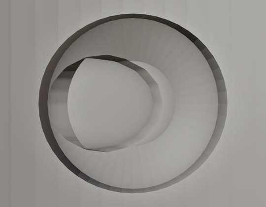
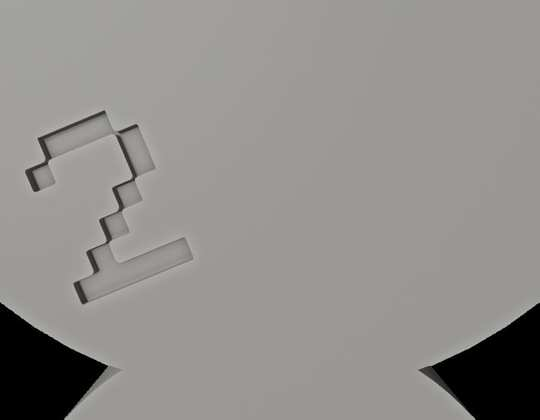

# DSG 9.7.2 — Paredes frangibles y marcas de perforación

## 1. Qué fallaba (9.6.8 – 9.7.1)

Lo medí sobre la geometría real generada en Blender 5.2.2.

| Problema | Consecuencia |
|---|---|
| La pared era un disco de Ø1,08 mm situado **entre 0,03 y 0,13 mm dentro del hueco de la fresa**, delante del puerto | No tocaba la pared del sleeve: se exportaba como una pieza suelta dentro del recorrido de la fresa y **no sellaba nada** |
| En modo C (el modo por defecto), el agua entra en el hueco por **dos salidas tangenciales a ±90°**, no por el puerto | Esas dos salidas quedaban **siempre abiertas** |
| La diana de Ø2,5 mm se restaba de un disco de Ø1,08 mm | **Nunca se grababa** |
| El anillo de la salida (radio 0,50–0,55 mm) caía en el borde del disco (radio 0,54 mm) | Quedaba un escalón, no una marca |
| La cruz medía 0,05 mm de ancho y 0,025 mm de hondo | Por debajo de la resolución de una impresora de resina: no se imprime |
| No existía previsualización ni el número de orden en la pieza | El cirujano no sabía dónde ni en qué orden perforar |

## 2. Nuevo diseño

```
 hueco de la fresa │ pared del sleeve ───────────────────────────▶
                   │
      avellanado  ╲│ ┌ bolsillo ┐┌ membrana ┐  conducto de irrigación
      0,20 mm      ╲ │ 0,30 mm  ││ 0,10 centro│  (el agua llega por aquí)
      (se resta)   │ └──────────┘│ 0,25 borde │
                   │             └────────────┘
```

- **Una membrana por cada salida:** dos en modo C y una en modo directo. Rellena el conducto 0,30 mm por detrás de la superficie del hueco y se solapa 0,15 mm con la pared para quedar soldada al unir las piezas.
- **Grosor:** 0,10 mm en el centro, que es el punto débil, y 0,25 mm en el borde. Así rompe por el centro y no se desprende entera.
- **Marca:** un avellanado cónico de 0,20 mm de profundidad, con un radio 0,30 mm mayor que la salida, más el bolsillo abierto de 0,30 mm delante de la membrana. Todo es material que **se quita**: en el hueco de la fresa nunca se añade nada, y la punta del explorador o de la fresa se centra sola en la marca.
- **Número de orden** (2, 3, …) grabado 0,30 mm en la cara exterior de la guía, junto a cada sleeve:
  - Cifra de 2,4 mm de alto, con trazos de unos 0,34 mm, imprimible en resina.
  - DSG busca automáticamente una zona plana, orientada hacia la cara oclusal, con ≥ 1,1 mm de material detrás y alejada de las salidas de irrigación.
  - Si no hay sitio, lo avisa en lugar de grabarlo en mal lugar.
- **Previsualización:** el botón **"Ver paredes y marcas"** del paso de irrigación muestra en rojo las membranas, los avellanados y los números, sin tocar la guía. Con **✕** se quitan.

| Avellanado, bolsillo y membrana vistos desde dentro del sleeve | Número de orden grabado junto al sleeve |
|---|---|
|  |  |

## 3. Errores de base encontrados y corregidos

1. **Modo directo con varios implantes:** el primer punto del conducto de cada sleeve **no activo** (todas las ramas vinculadas) se recolocaba dentro del sleeve **activo**. El resultado era un conducto espurio hacia el sleeve activo y el sleeve vinculado quedaba sin abrir. Ahora el sleeve propietario se determina a partir del propio punto.
2. **STL no manifold:** Blender triangula al exportar los polígonos cóncavos que dejan las operaciones booleanas exactas, y a veces genera una diagonal que duplica una arista existente, de modo que una arista queda compartida por 3 o más triángulos. Lo medí en sleeves reales de DSG. Ahora la copia de exportación se triangula antes con el método BEAUTY de Blender, y las aristas "pellizcadas" (4 o más caras) se separan sin mover ningún vértice. El control de calidad comprueba exactamente los triángulos que se escriben en el STL.
3. **Cifras con píxeles que solo se tocan en diagonal** (como en el "3"): generaban aristas no manifold en el cortador. Ahora el cortador de la cifra se funde con un remallado de vóxel de 0,03 mm.

## 4. Diseño del código (SOLID)

- **`dsg/frangible_seal.py`:** geometría pura, sin `bpy`. Contiene `SealDesign` (medidas y validación de imprimibilidad), los perfiles de la membrana y del avellanado, y `revolve()`, que genera un sólido de revolución cerrado.
- **`dsg/_guide_parts/06_irrigation_d_frangible.py`:** el adaptador de Blender. Incluye:
  - `frangible_outlets()`: localiza cada salida real en modo C o directo.
  - `build_frangible_irrigation_seal_object()` y `build_frangible_mark_cutters()`.
  - `find_order_label_site()`: busca dónde grabar el número.
  - El operador de previsualización.
- **Exportación:** une las membranas a la copia, resta avellanados y números, triangula y pasa el control de calidad. La guía de la escena no se modifica.
- **Limpieza:** se han eliminado las ocho constantes antiguas de marcas (diana, cruz, anillo) que ya no se usaban.

## 5. Verificación (Blender 5.2.2)

```
SUMMARY: compileall=PASS, ruff=PASS, pytest=PASS (121), blender_smoke=PASS, install_smoke=PASS
```

`tests/test_frangible_integration.py` se ejecuta en modo C y en modo directo sobre un sleeve real, con sus salidas cortadas por los cortadores de producción. Comprueba que:

- Antes del sello, el conducto está abierto.
- Después del sello, el primer sólido aparece a 0,30 mm (±0,01) en **cada** salida.
- Ningún vértice de la membrana entra en el hueco de la fresa.
- El avellanado y la cifra se cortan (el volumen baja) y la membrana queda intacta.
- La triangulación de exportación es manifold.
- La previsualización se muestra y se elimina.
- Todas las ramas de la red llegan a su propio sleeve.

`tests/test_frangible_seal.py` comprueba sin Blender:

- Que el sólido es cerrado.
- El volumen analítico.
- El grosor en el centro y en el borde, medido por rayos.
- Que el avellanado termina antes de la membrana.
- La validación de imprimibilidad.

## 6. Pendiente de validar en banco

- La presión de rotura real de 0,10 / 0,25 mm depende de la resina, del curado y de la orientación de impresión.
- En modo C hay **dos** membranas por sleeve y basta con perforar una para que llegue agua. Si se quiere, se puede cambiar a un único punto de perforación.
- El número se orienta de forma tangente al sleeve. Si prefieres que todos queden alineados con la arcada, es un ajuste pequeño.
